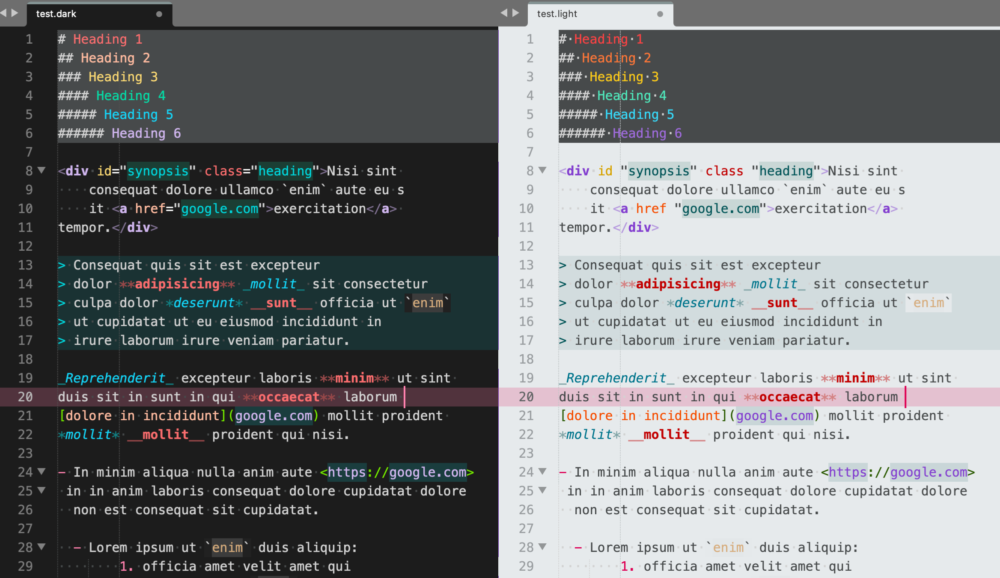

# Teenage - Color Schemes

A Sublime Text color scheme inspired by the [Teenage Engineering](https://teenage.engineering) [Pocket Operator](https://teenage.engineering/products/po) series of musical instruments.

Adds the following color schemes:

- Teenage Board - Dark
- Teenage Screen - Light



## recommended Preferences

```json
"line_padding_top": 2,
"line_padding_bottom": 2,
```

### Teenage Screen - Light

Consider a bold or heavy font, such as:

```json
"font_face": "SFMono-Heavy",
```


## Installation

### Sublime Text

#### Package Control

Make sure you already have [Package Control](http://wbond.net/sublime_packages/package_control/) installed.

3. From the Command Palette, choose *Package Control: Install Package*
4. Search for and select *Teenage Color Scheme* and press `Enter`
5. From the Command Palette, choose *UI: Select Color Scheme*
6. Search for "Teenage", find your desired version, and press `Enter`

With [auto_upgrade](http://wbond.net/sublime_packages/package_control/settings/) enabled, Package Control will keep all installed packages up-to-date!

#### Installation via git

1. Find your Packages folder with *Browse Packages* from the Command Palette.
2. Clone <https://github.com/dotHTM/Teenage.git> into your Packages folder 

#### Manual Installation

1. Download a `.sublime-color-scheme` file of choice
2. *Browse Packages* from the Command Palette (`Ctrl+Shift+P` on Windows/Linux, `⇧⌘P` on OS X)
3. Copy the `.sublime-color-scheme` file to `Packages`

## License

License is provided according to [LICENSE](https://github.com/dotHTM/Teenage/blob/master/LICENSE).

